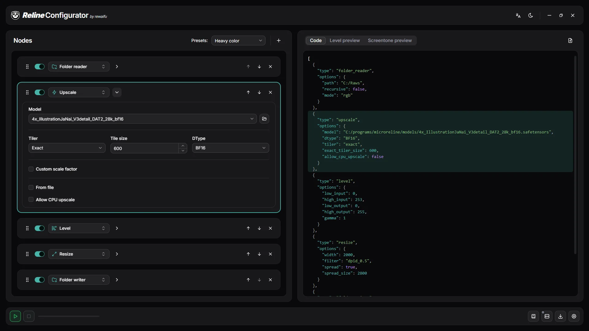

<div align="center">

# _Reline_ Configurator

**Visual builder for [Reline](https://github.com/rewaifu/reline) upscaling-pipeline configs.**

English · [Русский](README.ru.md)



</div>

## What is this?

**Reline Configurator** is a single-page React app that lets you assemble those configs visually, without hand-writing JSON.

It comes in two flavors:

- **Web** — Build a config, then use it in [Colab](https://colab.research.google.com/drive/1-ijaR4Ld_CUkEMb-l2Cbf918TCQOp8D9).
- **Desktop** (Tauri V2) — runs the whole pipeline locally. Uses [Reline-WS](https://github.com/rewaifu/reline_ws) as a backbone.


## Desktop system requirements

- **Windows**: WebView2 (preinstalled on Windows 10/11).
- **Linux** : WebKitGTK (`libwebkit2gtk-4.1-0`) and GTK 3 (`libgtk-3-0`). Present on most desktop  distros (e.g. Ubuntu 22.04+); `.deb`/`.rpm` pull them in automatically, the `.AppImage` expects them on the system.

## Building and running

### Building Requirements
- **[Bun](https://bun.sh)** (recommended) or any other Node package manager. All commands below are written for Bun.
- **Rust** (stable) — only for the desktop build.

At first install web dependencies:
```bash
bun install
```

### Web

```bash
bun run build      # typecheck (tsc -b) then build to dist/
bun run preview    # serving files from dist/
```

### Desktop (Tauri)

```bash
bun tauri build    # production build (all bundle targets for the current OS)
```

---
## Links

- **Our Discord**: https://discord.gg/hEgdaVzTs9
