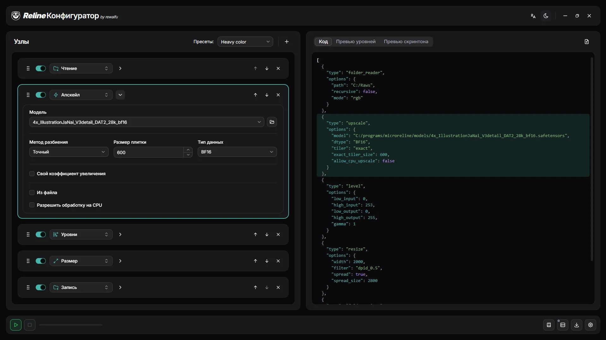

<div align="center">

# _Reline_ Конфигуратор

**Визуальный конструктор конфигов для апскейл-пайплайнов манги на базе [Reline](https://github.com/rewaifu/reline).**

[English](README.md) · Русский



</div>

## Что это такое?

**Reline Configurator** — одностраничное React-приложение, позволяющее собирать такие конфиги визуально, без ручного написания JSON.

Есть две версии:

- **Веб** — соберите конфиг, а затем используйте его в [Colab](https://colab.research.google.com/drive/1-ijaR4Ld_CUkEMb-l2Cbf918TCQOp8D9).
- **Десктоп** (Tauri V2) — запускает весь пайплайн локально. В качестве основы использует [Reline-WS](https://github.com/rewaifu/reline_ws).


## Системные требования для десктопа

- **Windows**: WebView2 (предустановлен в Windows 10/11).
- **Linux**: WebKitGTK (`libwebkit2gtk-4.1-0`) и GTK 3 (`libgtk-3-0`). Присутствуют в большинстве десктопных дистрибутивов (например, Ubuntu 22.04+); `.deb`/`.rpm` подтягивают их автоматически, а `.AppImage` рассчитывает на их наличие в системе.

## Сборка и запуск

### Требования для сборки
- **[Bun](https://bun.sh)** (рекомендуется) или любой другой Node-менеджер пакетов. Все команды ниже написаны для Bun.
- **Rust** (stable) — только для сборки десктопной версии.

Сначала установите веб-зависимости:
```bash
bun install
```

### Веб

```bash
bun run build      # проверка типов (tsc -b), затем сборка в dist/
bun run preview    # раздача файлов из dist/
```

### Десктоп (Tauri)

```bash
bun tauri build    # продакшн-сборка (все бандлы для текущей ОС)
```

---
## Ссылки

- **Наш Discord**: https://discord.gg/hEgdaVzTs9
